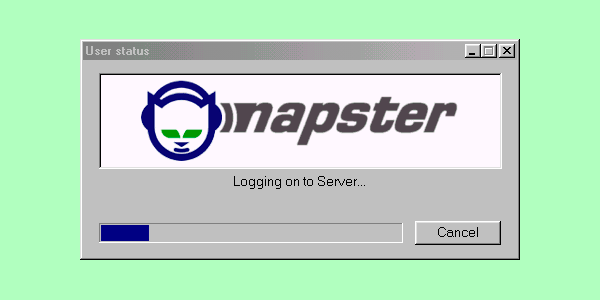

<p align="center">
    
</p>

**Team: Gabe, Seven, Max**

# mini-napster

A mini version of Napster, a P2P file-sharing application. This project is a final project for CS 386 at PLU. It is a command-line application that allows users to search for and download files from other users on the same network. It uses a central tracker to keep track of all the files that are being shared and downloaded.

The application is written in Python and uses the following libraries:

- Flask for the REST API
- Requests for making HTTP requests to the tracker
- Sqlite3 for the database operations for client-side tracking
- Socket for UDP communication

## Getting Started

### Prerequisites

- Python 3.13 or higher

### Installation

1.  Clone the repository:
    ```sh
    git clone https://github.com/Guuzzeji/mini-napster.git
    ```
2.  Install the required packages:
    ```sh
    pip install -r requirements.txt
    ```

## How to Run

To run mini-napster, you need to start both the central tracker server and the client application.

### 1. Run the Central Tracker

The central tracker is a Flask server that keeps track of all the files being shared.

```sh
python nap-central-tracker/server.py
```

Default port is `3030`

### 2. Run the Client

The client is a command-line application that allows you to search for and download files.

```sh
python cli.py
```

Make sure to config your `config.txt` in the root of the `nap-data` folder.

- `[USERNAME]` (optional): Your username. Defaults to a random username.
- `[IP]` (optional): Your IP address. Defaults to `127.0.0.1` for localhost.
- `[PORT]` (optional): The port to run the client on. Defaults to a random port.

i.e what `config.txt` should look like:

```txt
anon
127.0.0.1
8080
```

## Sharing Files

To share files, simply place your `.mp3` files in the `nap-data/sharing` directory. The application will automatically scan this directory and make the files available to other users. When a user requests to download a file from you, the application will automatically chunk the file and send it to the user.

## Project Overview

The mini-Napster project is a simplified peer-to-peer (P2P) file-sharing system inspired by the original Napster. It enables users to share and download files within a network. The system consists of the following components:

1. **Central Tracker**: A server that maintains metadata about shared files and their locations.
2. **Client Application**: A command-line interface for users to interact with the system, including searching for files, downloading, and managing shared files.
3. **File Management**: Handles the organization and sharing of files, including chunking for efficient transfers.
4. **UDP Communication**: Facilitates fast and lightweight communication between peers.

## File Structure

The project is organized as follows:

```
mini-napster/
├── cli.py                # Entry point for the command-line interface
├── LICENSE               # License file
├── pyproject.toml        # Project configuration
├── README.md             # Project documentation
├── requirements.txt      # Python dependencies
├── nap-central-tracker/  # Central tracker server
│   └── server.py         # Tracker server implementation
├── napster/              # Core application logic
│   ├── commands/         # CLI commands
│   │   ├── check_sharing.py
│   │   ├── clear.py
│   │   ├── download.py
│   │   ├── downloads.py
│   │   ├── leachers.py
│   │   ├── print_table.py
│   │   └── search_files.py
│   ├── core/             # Core functionality
│   │   ├── client.py     # Client-side logic
│   │   ├── constants.py  # Shared constants
│   │   ├── server.py     # Server-side logic
│   │   ├── singleton.py  # Singleton pattern implementation
│   │   ├── database/     # Database management
│   │   │   └── db_manager.py
│   │   ├── file_manager/ # File management utilities
│   │   │   ├── file_manager.py
│   │   │   ├── folder_struct.py
│   │   │   └── mp3_file.py
│   │   ├── tracker_handler/ # Central Tracker communication
│   │   │   ├── request_bodies.py
│   │   │   └── tracker.py
│   │   └── udp/          # UDP communication
│   │       ├── download_manager.py
│   │       ├── messages.py
│   │       ├── sharing_files_manager.py
│   │       └── udp.py
├── napster.egg-info/     # Metadata for the Python package
├── spec/                 # Project specifications
│   ├── tracker.md        # Tracker design
│   └── ux.md             # User experience design (not used)
│   └── assets/           # Supporting assets
```

## Client Folder Structure

```
nap-data/             # Data storage for shared files
├── config.txt        # Configuration file
├── downloads/        # Downloaded files (where worker chunks are saved)
├── mp3/              # MP3 files (constructed from worker chunks)
└── sharing/          # Files being shared (also store mp3 files you want to share)
│   └── chunks/       # File chunks for sharing (chunk of each mp3 file you want to share, stored separately in folders by file name)
```
