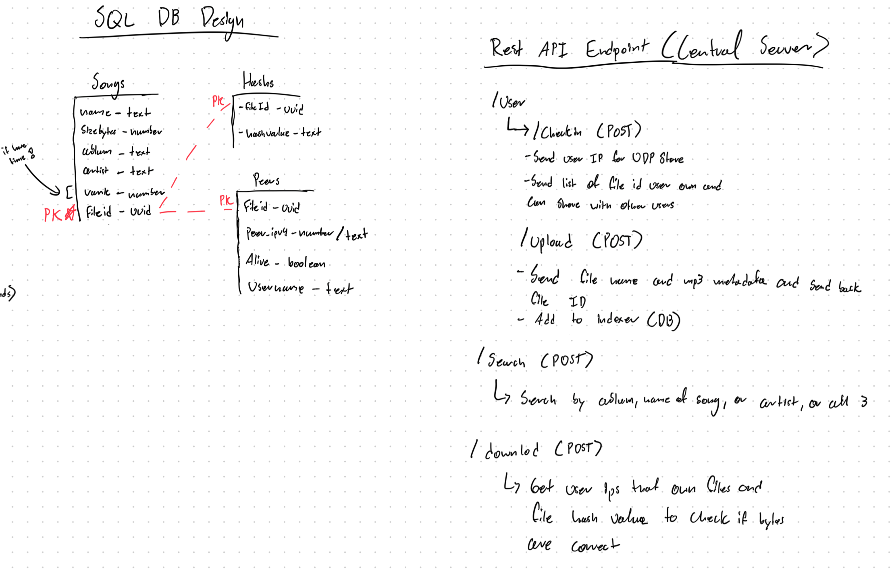

## Napster Central File Tracker

This is the central file tracker for the napster project. It is used to keep track of all the files that are being shared and downloaded.

**Goals:**

- Keep track of all the files that are being shared and downloaded
- Keep track of all users that are active
- Link users who want to download a mp3 to users that have the mp3

**Features:**

- Keep track of all the files that are being shared and downloaded
- Keep track of all users that are active
- Users can search for different mp3 that want to download and get a list of users that have the mp3
  - From there a user can download the mp3 via UDP (getting that other users ip address from the tracker)
- Users can upload files to the tracker so they can be tracked
  - Don't upload the actual file, instead upload the metadata of that file to the tracker
  - Key is that once this mp3 meta data is uploaded to the tracker it is stored in the database and sync to that users personal database
  - Mp3 file keys should be sync between users database and central file tracker

## How it works

This will be done via a simple REST API that will be used to upload mp3 metadata to the central file tracker. As well as checking on user health, via a heartbeat check via UDP. This REST API will store all information into a database (most likely postgres).

> NOTE: Feel free to design the database however you want, it just needs to work and make sure to sync data between the central file tracker and the users personal database

**REST API:**

- /user
  - POST: /checkin
    - When a user goes online, they most checkin in order to show that there files are currently active and allow the server to do a heartbeat check
    - User sends their ip and port
    - RETURN: 200 OK
  - POST: /upload-metadata
    - This is used to upload mp3 metadata to the central file tracker
      - Song name
      - Artist name
      - Album name
      - Duration
      - File Siz
      - Year
      - Checksum
      - Id (uuid created by the server, this will be sent back to the client for it own tracking)
    - RETURN: 200 OK and the key for the client to use in it own database
- GET: /search
  - This is used to sarch for mp3s that a user wants to download
  - i.e /search?artist=artist_name&song=song_name
  - RETURN: 200 OK and a list of users that have the song (as a json object)
- GET: /download
  - This is used to download mp3s from the central file tracker
  - i.e /download?id=id
  - RETURN: 200 OK and the port and ip of the user that has the mp3, as well as the checksum of the mp3

**Resources:**

- Feel free to use whatever framework you want. But for speed try using flask or express
- Also please put the code in a separate folder called "nap-central-tracker"
- And use docker to manage everything
