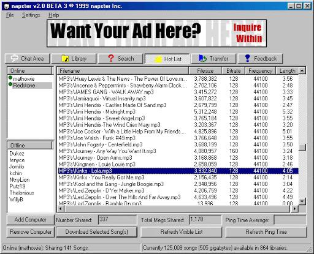

## UX Spec

The goal of this project is to create a simple and easy to use application that allows users to search for mp3s and download them from a central file tracker. Should be close to how napster looked in 1990s

## Design

**Inspiration board:**

**UX Design 1990s**

**Goals Core:**

- Follow same design as napster from 1990s
  - Going for Windows 98 look
- Simple and easy to use
  - Only have two pages
    - Home page: Searching for songs
    - Download page: Downloading songs

**Stretch Goals:**

- Ad funny 90s ads to it

**Features:**

- Search for songs
  - Search by song name
  - Search by artist
  - Should display a list of songs in a table
    - Table should have
      - Song name
      - Artist
      - Duration
      - File size
      - Download button (click to download song)
- Download songs
  - Should display a list of songs in a table
  - Table should have
    - Song name
    - Artist
    - File size
    - Download Progress Bar (should be number of current chunks / total chunks)
      - Once all chunks are downloaded, should display "Download Complete (Building MP3 file)"
    - When mp3 is done downloading, remove from table

**Tech:**

Use Python QT6, similar to JavaFX but for Python. Use model, view, concept to manage UX actions.

Resources:

- https://www.pythonguis.com/tutorials/pyqt6-qtableview-modelviews-numpy-pandas/
- https://python-forum.io/thread-39253.html
- https://doc.qt.io/qtforpython-6/PySide6/QtWidgets/QTableView.html
- https://coderslegacy.com/python/pyqt6-qtablewidget-example/
- https://stackoverflow.com/questions/60904814/how-to-change-window-widget-with-pyqt5-using-ui-files
- https://pypi.org/project/PyQt6/
